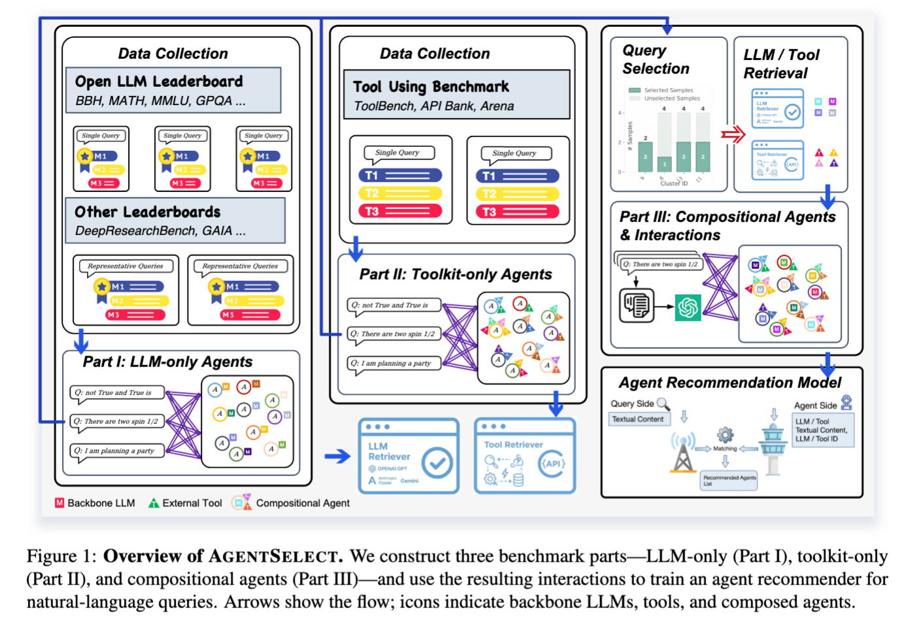
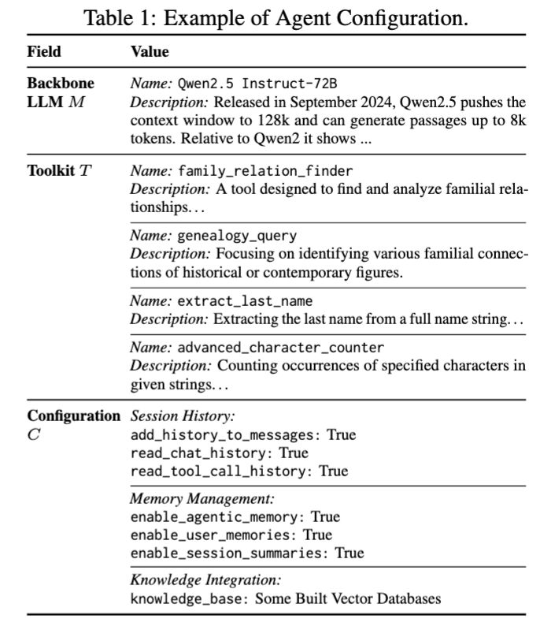
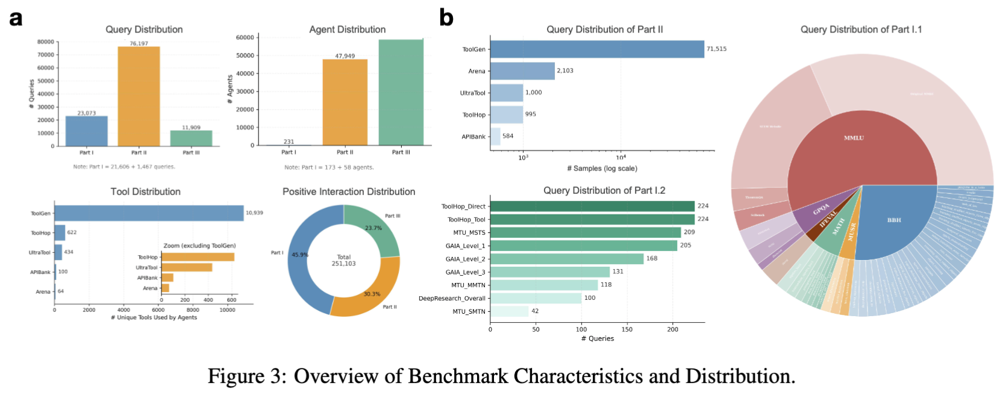
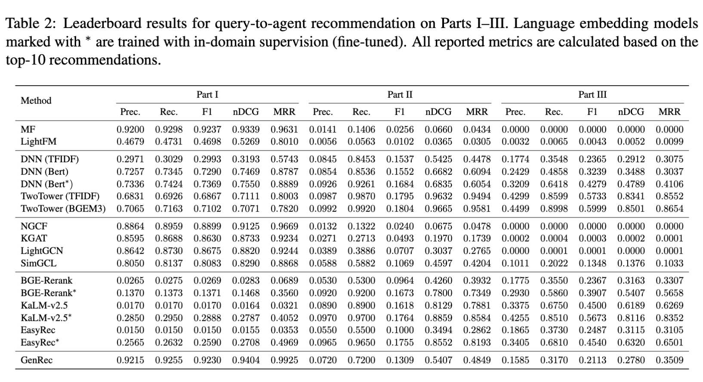

# AgentSelectBench 🌟

**AgentSelectBench (AGENTSELECT)** is a unified-supervision benchmark for **narrative query-to-agent recommendation**: given a free-form natural-language request, rank **deployable agent configurations** represented as capability profiles **(backbone LLM, toolkit)**. It systematically converts heterogeneous evaluation artifacts (LLM leaderboards, tool-use benchmarks, etc.) into **query-conditioned, positive-only** interactions for training and evaluating agent recommenders at scale. 

<div align="center">
  
</div>

> **Status:** this repository is **under active refinement**. We are progressively cleaning code, adding missing scripts/docs, and improving reproducibility. If, during review, you notice incomplete parts or rough edges, please treat them as ongoing engineering work—we are actively consolidating everything.

---

## Why AgentSelectBench ✨

Modern agent ecosystems offer an exploding space of configurations, but existing benchmarks evaluate **components in isolation** (models or tools). AgentSelectBench instead supports the end task:

* **Input:** a narrative query (no persistent user ID; intent is fully expressed in the query)
* **Output:** a ranked list of **deployable agents** as capability profiles **(M, T)**
* **Supervision:** **positive-only** query–agent interactions unified across sources 

---

## Capability Profile Format 🧾

Each agent is represented as a **capability profile**:

* **Backbone LLM**: `M`
* **Toolkit**: `T` (a set of tools with name + description)
* Stored as a **YAML configuration** to keep agents *deployable* (while we benchmark the stable capability core `(M, T)`). When deployed with agent framework, some additional configurations `C` may also required. 

<div align="center">
  
</div>

---


## Benchmark Overview 📦


<div align="center">
  
</div>

AgentSelectBench comprises three complementary dataset parts:

### 🧩 Part I — LLM-only Agents

Query-conditioned supervision derived from LLM evaluations/leaderboards (tools absent). Positives are typically constructed as **top-k** preferred backbones per query. 

### 🧰 Part II — Toolkit-only Agents

Tool-use benchmarks provide the **required/reference toolkit** for each query; we treat each query’s toolkit as the positive target (backbone fixed to a placeholder). 

### 🔗 Part III — Compositional Agents

We synthesize realistic **(M, T)** configurations by retrieving relevant components and composing them into candidate agents, yielding **pseudo-positive** interactions designed to reflect capability-consistent supervision. 

**Scale (current release):** 111,179 queries, 107,721 agents, 251,103 interactions aggregated from 40+ sources. 


---


## Benchmark Results

Table 2 summarizes the overall leaderboard performance across Parts I–III and the full benchmark. Overall, the strongest gains come from content-aware capability matching that leverages the natural-language descriptions of queries, backbone models, and tools, rather than relying primarily on ID-based collaborative signals. This trend is most pronounced in the long-tail, sparse regimes (especially Parts II/III), where interaction reuse is limited and generalization to previously unseen or rarely-seen configurations is essential. Together, the results support AgentSelectBench’s core premise: effective narrative query-to-agent recommendation benefits from semantic alignment at the capability level, and the benchmark provides a reliable stress test for such generalization.

<div align="center">
  
</div>


### Leaderboard (Top-10) — Part I

| Method           |  Prec. |   Rec. |     F1 |   nDCG |    MRR |
| ---------------- | -----: | -----: | -----: | -----: | -----: |
| MF               | 0.9200 | 0.9298 | 0.9237 | 0.9339 | 0.9631 |
| LightFM          | 0.4679 | 0.4731 | 0.4698 | 0.5269 | 0.8010 |
| DNN (TFIDF)      | 0.2971 | 0.3029 | 0.2993 | 0.3193 | 0.5743 |
| DNN (Bert)       | 0.7257 | 0.7345 | 0.7290 | 0.7469 | 0.8787 |
| DNN (Bert*)      | 0.7336 | 0.7424 | 0.7369 | 0.7550 | 0.8889 |
| TwoTower (TFIDF) | 0.6831 | 0.6926 | 0.6867 | 0.7111 | 0.8003 |
| TwoTower (BGEM3) | 0.7065 | 0.7163 | 0.7102 | 0.7071 | 0.7820 |
| NGCF             | 0.8864 | 0.8959 | 0.8899 | 0.9125 | 0.9669 |
| KGAT             | 0.8595 | 0.8688 | 0.8630 | 0.8733 | 0.9234 |
| LightGCN         | 0.8642 | 0.8730 | 0.8675 | 0.8820 | 0.9244 |
| SimGCL           | 0.8050 | 0.8137 | 0.8083 | 0.8290 | 0.8868 |
| BGE-Rerank       | 0.0265 | 0.0275 | 0.0269 | 0.0283 | 0.0689 |
| BGE-Rerank*      | 0.1370 | 0.1373 | 0.1371 | 0.1468 | 0.3560 |
| KaLM-v2.5        | 0.0170 | 0.0170 | 0.0170 | 0.0164 | 0.0321 |
| KaLM-v2.5*       | 0.2850 | 0.2950 | 0.2888 | 0.2787 | 0.4052 |
| EasyRec          | 0.0150 | 0.0150 | 0.0150 | 0.0155 | 0.0353 |
| EasyRec*         | 0.2565 | 0.2632 | 0.2590 | 0.2708 | 0.4969 |
| GenRec           | 0.9215 | 0.9255 | 0.9230 | 0.9404 | 0.9925 |

---

### Leaderboard (Top-10) — Part II

| Method           |  Prec. |   Rec. |     F1 |   nDCG |    MRR |
| ---------------- | -----: | -----: | -----: | -----: | -----: |
| MF               | 0.0141 | 0.1406 | 0.0256 | 0.0660 | 0.0434 |
| LightFM          | 0.0056 | 0.0563 | 0.0102 | 0.0365 | 0.0305 |
| DNN (TFIDF)      | 0.0845 | 0.8453 | 0.1537 | 0.5425 | 0.4478 |
| DNN (Bert)       | 0.0854 | 0.8536 | 0.1552 | 0.6682 | 0.6094 |
| DNN (Bert*)      | 0.0926 | 0.9261 | 0.1684 | 0.6835 | 0.6054 |
| TwoTower (TFIDF) | 0.0987 | 0.9870 | 0.1795 | 0.9632 | 0.9494 |
| TwoTower (BGEM3) | 0.0992 | 0.9920 | 0.1804 | 0.9665 | 0.9581 |
| NGCF             | 0.0132 | 0.1322 | 0.0240 | 0.0675 | 0.0478 |
| KGAT             | 0.0271 | 0.2713 | 0.0493 | 0.1970 | 0.1739 |
| LightGCN         | 0.0389 | 0.3886 | 0.0707 | 0.3037 | 0.2765 |
| SimGCL           | 0.0588 | 0.5882 | 0.1069 | 0.4597 | 0.4204 |
| BGE-Rerank       | 0.0530 | 0.5300 | 0.0964 | 0.4260 | 0.3932 |
| BGE-Rerank*      | 0.0920 | 0.9200 | 0.1673 | 0.7800 | 0.7349 |
| KaLM-v2.5        | 0.0890 | 0.8900 | 0.1618 | 0.8129 | 0.7881 |
| KaLM-v2.5*       | 0.0970 | 0.9700 | 0.1764 | 0.8859 | 0.8584 |
| EasyRec          | 0.0550 | 0.5500 | 0.1000 | 0.3494 | 0.2862 |
| EasyRec*         | 0.0965 | 0.9650 | 0.1755 | 0.8552 | 0.8193 |
| GenRec           | 0.0720 | 0.7200 | 0.1309 | 0.5407 | 0.4849 |

---

### Leaderboard (Top-10) — Part III

| Method           |  Prec. |   Rec. |     F1 |   nDCG |    MRR |
| ---------------- | -----: | -----: | -----: | -----: | -----: |
| MF               | 0.0000 | 0.0000 | 0.0000 | 0.0000 | 0.0000 |
| LightFM          | 0.0032 | 0.0065 | 0.0043 | 0.0052 | 0.0099 |
| DNN (TFIDF)      | 0.1774 | 0.3548 | 0.2365 | 0.2912 | 0.3075 |
| DNN (Bert)       | 0.2429 | 0.4858 | 0.3239 | 0.3488 | 0.3037 |
| DNN (Bert*)      | 0.3209 | 0.6418 | 0.4279 | 0.4789 | 0.4106 |
| TwoTower (TFIDF) | 0.4299 | 0.8599 | 0.5733 | 0.8341 | 0.8552 |
| TwoTower (BGEM3) | 0.4499 | 0.8998 | 0.5999 | 0.8501 | 0.8654 |
| NGCF             | 0.0000 | 0.0000 | 0.0000 | 0.0000 | 0.0000 |
| KGAT             | 0.0002 | 0.0004 | 0.0003 | 0.0002 | 0.0001 |
| LightGCN         | 0.0000 | 0.0001 | 0.0001 | 0.0000 | 0.0001 |
| SimGCL           | 0.1011 | 0.2022 | 0.1348 | 0.1376 | 0.1033 |
| BGE-Rerank       | 0.1775 | 0.3550 | 0.2367 | 0.3163 | 0.3307 |
| BGE-Rerank*      | 0.2930 | 0.5860 | 0.3907 | 0.5407 | 0.5658 |
| KaLM-v2.5        | 0.3375 | 0.6750 | 0.4500 | 0.6189 | 0.6269 |
| KaLM-v2.5*       | 0.4255 | 0.8510 | 0.5673 | 0.8116 | 0.8352 |
| EasyRec          | 0.1865 | 0.3730 | 0.2487 | 0.3115 | 0.3105 |
| EasyRec*         | 0.3405 | 0.6810 | 0.4540 | 0.6320 | 0.6501 |
| GenRec           | 0.1585 | 0.3170 | 0.2113 | 0.2780 | 0.3509 |

---


## Online Demo (WIP) 🧪

We reserve a demo endpoint in the paper as a lightweight interface that takes a narrative query and returns the recommended agent configuration.

* **Demo URL (reserved / under development):** `https://api.achieva-ai.com/OneAgent` 
* **Note:** the demo is **still being developed** and may not be fully functional during review.

---

## Project Code Structure 🏗️

A typical structure (may evolve as we refactor):

```
AgentSelectBench/
├── agent_rec/                      # Research scaffold for agent recommendation
│   ├── data/                        # Dataset loaders / parsing
│   ├── features/                    # Unified feature interfaces (text + IDs)
│   ├── models/                      # Baselines (MF/LightFM/TwoTower/etc.)
│   ├── eval/                        # Metrics + evaluation harness
│   └── utils.py                     # Shared utilities (metrics printing, etc.)
├── scripts/                         # Helper scripts (training / eval wrappers)
├── run_bpr_mf_knn.py                # MF baseline with KNN query-vector surrogate
├── run_lightfm_handwritten.py       # LightFM baseline
├── run_generative.py                # Inference-only structured/generative baseline
├── run_generative_train.py          # Optional: seq2seq finetuning from exported pairs
├── requirements.txt
└── README.md
```

---

## Getting Started 🚀

### 1) Clone the repository

```bash
git clone https://github.com/<your-org-or-anon-link>/AgentSelectBench.git
cd AgentSelectBench
```

### 2) Install dependencies

```bash
python -m venv .venv
source .venv/bin/activate  # Linux/Mac
# .venv\Scripts\activate   # Windows

pip install -r requirements.txt
```

### 3) Prepare dataset

AgentSelectBench is constructed from **publicly available** leaderboards / benchmarks.
Depending on upstream redistribution constraints, we provide **derived annotations/statistics** and scripts to reconstruct raw sources when required. 

---

## Evaluation Protocol 📊

* **Positives:** Part I (top-10), Part II (top-1), Part III (top-5)
* **Ranking cutoff:** fixed **Top-10** evaluation
* **Reporting:** metrics are reported for **Part I / Part II / Part III / Overall** 

---

## Quick Runs 🛠️

### Run (BPR-MF + KNN q-vector)

```bash
python run_bpr_mf_knn.py \
  --data_root /path/to/dataset_root \
  --device cuda:0 \
  --epochs 5 --batch_size 4096 --factors 128 --neg_per_pos 1 \
  --knn_N 3 --eval_cand_size 100 --score_mode dot
```

### Run (LightFM)

```bash
python run_lightfm_handwritten.py \
  --data_root /path/to/dataset_root \
  --device cuda:0 \
  --epochs 5 --batch_size 4096 --factors 128 --neg_per_pos 1 \
  --alpha_id 1.0 --alpha_feat 1.0 --max_features 5000 \
  --knn_N 3 --eval_cand_size 100 \
  --use_tool_id_emb 1
```

**Note:** this scaffold assumes you have `utils.py` in the same folder as the entry scripts, providing `print_metrics_table(...)` (consistent with the current research scaffold).

---

## Generative / Structured Baseline (Inference-Only) ✍️

This entrypoint is **inference-only** (no training). It fits a TF-IDF retriever each run, then formats structured token outputs for a query. You can also export supervised pairs for training an external seq2seq model.

### Generate structured token outputs (LLM + tools) for a query

```bash
python run_generative.py \
  --data_root /path/to/dataset_root \
  --query "How do I write a web scraper?" \
  --top_k 3 \
  --with_metadata 1
```

### Export supervised pairs for seq2seq finetuning (JSONL)

```bash
python run_generative.py \
  --data_root /path/to/dataset_root \
  --export_pairs /tmp/generative_pairs.jsonl \
  --max_examples 5000
```

### Fine-tune a seq2seq model (e.g., T5) on exported pairs

```bash
python run_generative_train.py \
  --data_root /path/to/dataset_root \
  --output_dir /tmp/generative_t5_ckpt \
  --model_name t5-small \
  --epochs 3 \
  --batch_size 16
```

### Shell helper (env-style)

```bash
DATA_ROOT=/path/to/dataset_root \
QUERY="How do I write a web scraper?" \
TOP_K=3 \
WITH_METADATA=1 \
./scripts/run_generative.sh
```

---

## Reproducibility Notes 🧪

* We will keep adding: dataset build scripts, caching, and deterministic evaluation harnesses.
* If you are reviewing this work and find a missing script or unclear step, it likely reflects ongoing repository cleanup rather than missing methodology; please feel free to flag it—we are actively addressing gaps.

---

## Citation 📚

We will submit paper to Arxiv soon.
